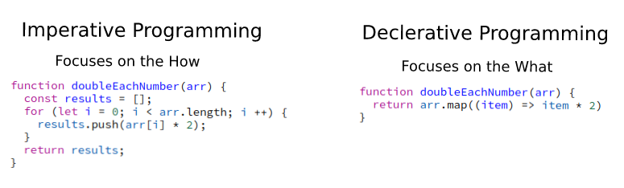

Before we start talking about the differences between these two paradigms, I'd like to to provide you with a few reasons as to why you should understand the differences in the first place.

First, one of the most common areas these paradigms come up is when comparing OOP to FP. (FP is declarative, while OOP is often imperative)

The differences between FP and OOP is a topic for a different article, so we will not expand on it here. With that being said, understanding the difference between these two paradigms can help you understand the differences between OOP and FP in a better way.

Another benefit is that it will help you define your code better. At the end of the day you are probably using both paradigms today when you write code, even if you're not aware of it.

Understanding the differences will help you plan in advance and define things better.

With all of that being said, let's get into it!

**Imperative Programming**

Imperative programming is a programming paradigm that focuses on a sequence of instructions. This paradigm is opposite from declarative programming because it focuses on the **how** and not the **what.**

**Declarative Programming**

Declarative programming is a programming paradigm which expresses the logic of the program without expressing its control flow. It focuses on the **what** and not the **how.** Essentially, it abstracts the how.

These are two different mental models, the imperative focuses on "how you do something", and is similar to how a machine works. The declarative focuses on "what to do", fitting more to the programmer mental model.

**A real life analogy**

Imagine you want to take a cab to the train station.

The imperative approach would be to tell the driver:

- Drive straight
- Then turn right on flowers street
- Then exit the second roundabout
- Drop me off at entrance 2

While the declarative approach would be:

- Take me to the train station

As you can see the imperative approach is very procedural, all the implementation details are exposed and the "what" can become unclear.

The declarative however is simpler, it abstracts the implementation detail and allows you to focus on what matters, the what.

**Code example**

Before we get into the pros and cons of each, let's take a look at a code example:

Which one is easier to read?

****Comparing these paradigms****

As mentioned before the differences between these paradigms sums up to the level of abstractions. Declarative programming is just an abstraction of imperative programming that happens behind the scenes.

This gives declarative programming few advantages:

1. **Readability** - declarative code is closer to human language, therefore is more understandable as well.
2. **Shorter** - declarative programming is shorter, you get more with less lines of code. Less lines of codes means less places for bugs to pop up as well.
3. **Reuse** - it's a lot easier to reuse declarative code (as the what is clear, it exposes a certain interface and allow others to use that interface)
4. **Scalable** - often this can also means the code is more scalable, as optimizations happen behind the scenes. (e.g. using the `sort` method in the language vs building it yourself, by using the language method you're able to take advantages of optimizations that happen behind the scenes)

Does this mean you should always write declarative code? Well, no. There are a few cases that imperative programming is a fit:

1. **When abstractions are not enough** - Abstractions are useful to create, but a lot of the times they can limit you. You can lose control of things to work and lose abilities to do certain things, which might be needed for project for example.
2. **When code is not readable -** Another case where I think it can be good to use imperative code is if the declarative code is so abstracted where you can't understand what's going on. It's better for the code to be readable even if it has a few more lines.

To sum it up, there are mostly advantages to declarative programming and most of the time it's better to write declarative code.

With that being said, sometimes you want to write imperative code when there's a need and the abstraction doesn't fit your needs or if the abstraction affects code readability.
