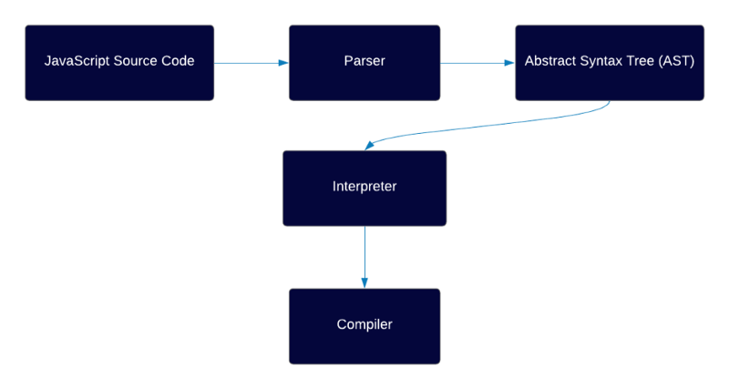
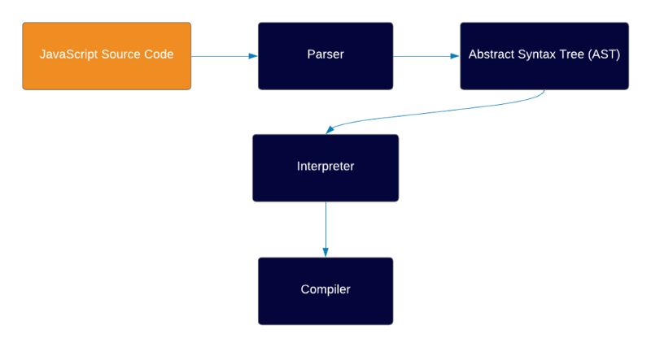
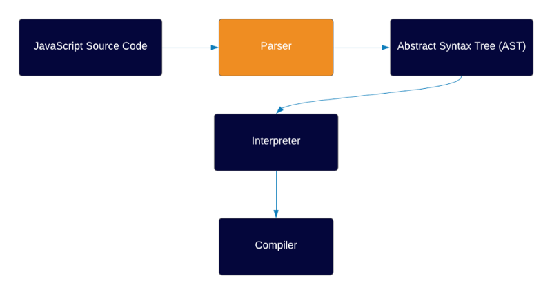
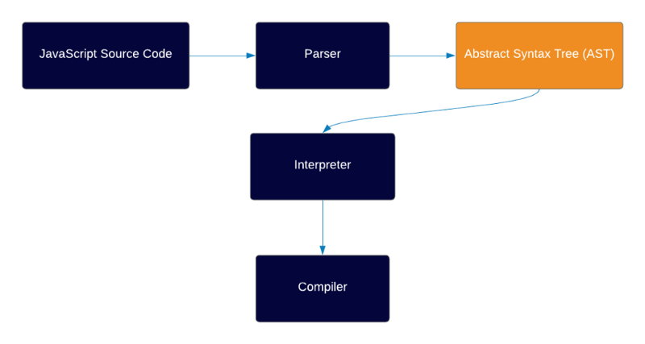
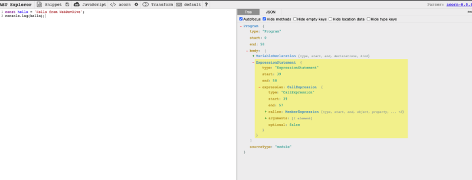
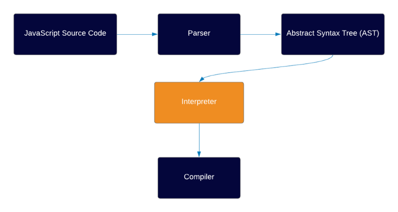
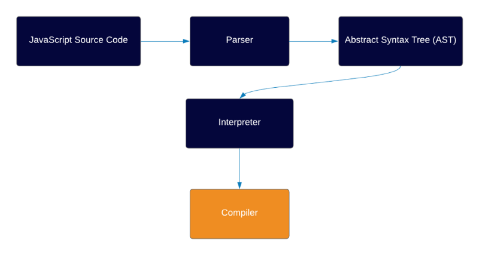
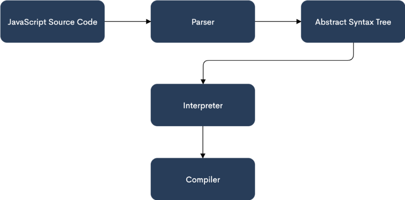

### Introduction

Have you ever asked yourself “how does this all work behind the scenes?”. I know I have.

In the following series of articles we will dive deep into the world of JS, how it works behind the scenes, from the Engine, to concepts like hoisting, execution context, lexical environment and more.

Having a deep understanding of certain concepts allows to understand code in a much better way, perform better in our job and in addition to that it’s super helpful in job interviews.

And also it can be a super fun subject to learn…

One more thing that’s important to mention before we start — every JS engine is built differently and it’s impossible to cover how all of them work. Therefore we will be exploring how V8 works, but the concepts are still very similar in other engines, it’s just that some of them might implement things differently.

Here’s a general overview of how a V8 works:



Don’t worry if you don’t understand any of this yet, at the end of the article you’ll understand every step of this diagram.

So with that out of the way, let’s go!

### Environment

A computer, a compiler, or even a browser can’t actually ‘understand’ code that’s written in JS. If so, how does the code runs?

Behind the scenes, JS always runs in a certain environment, most common ones are:

1. Browser (by far the most common)
2. Node.js (which is a runtime environment which allows you to run JS outside of the browser, usually in servers)

### Engine



So JS needs to run in certain environment, but what exactly is in the environment?

When you write code in JS, you write it in human-readable syntax, with alphabets and numbers. As mentioned, a machine can not understand this type of code.

This is why each environment has an engine.

In general, the engine’s job is to take that code and transform it into a code written in [machine code](https://en.wikipedia.org/wiki/Machine_code) which can eventually be run by the computer processor.

Each environment has its own engine, the most common ones are Chrome V8 (which Node also uses), Firefox SpiderMonkey, JavaScriptCore by Safari and Chakra by IE.

All engines work in a similar fashion but there are differences between each engine.

It’s also important to keep in mind that behind the scenes an engine is simply a software, Chrome V8 for example is a software written in C++.

### Parser



So we have an environment, and we have an engine inside that environment. The first thing the engine does upon executing your code is checking the code using the parser.

The parser knows JS syntax and rules, and its job is to go through the code line by line and check if the syntax of the code is correct.

If the parser comes across an error, it stops running and send out an error. If the code is valid, the parser generates something that’s called an [Abstract Syntax Tree](https://en.wikipedia.org/wiki/Abstract_syntax_tree) (or AST in short)

### Abstract Syntax Tree (AST)



So our environment has an engine, which has a parser, which generates an AST. But what is an AST and why do we need it?

AST is a data structure, which is not unique to JS but actually used by a lot of other languages by their compiler (some of them are Java, C#, Ruby, Python).

An AST is simply a tree representation of your code, and the main reason the engine creates an AST instead of compiling directly to a machine code is that it’s easier to convert to machine code when you have the code inside a tree data structure.

You can actually check out how the AST looks like, just put any code in the website [ASTExplorer](https://astexplorer.net/) and check out the data structure that’s created:



### The Interpreter



The Interpreter job is to take the AST that has been created and transform it into an [Intermediate Representation](https://en.wikipedia.org/wiki/Intermediate_representation#:~:text=An%20intermediate%20representation%20%28IR%29%20is,such%20as%20optimization%20and%20translation.) of the code (IR).

We will learn more about the interpreter soon as further context is required in order to fully understand what it is.

### The Intermediate Representation (IR)

So what is this IR the interpreter generates from the AST?

An IR is a data structure or code which represents the source code. Its role is to be an intermediate step between code that’s written in an abstract language such as JS to machine code.

Essentially you can think of IR as an abstraction of machine code.

There are many types of IR, a very popular among JS engines is Bytecode. Here’s a picture which demonstrates the IR role in the V8 engine:


But you might be asking… Why do we need to have an IR? Why not just compile straight to machine code. There are 2 primary reasons why Engines use IR as an intermediate step between high-level code and machine code:

Machine code written for Intel processor and machine code written for an ARM processor will be different. An IR on the other-hand, will match both as is universal and can match any platform. This makes the following conversion process easier and more mobile.

2\. **Optimizations** — it’s easier to run optimizations with IR compared to Machine code, this is true both from code optimizations point of view and hardware optimizations.

Fun fact: JS engines are not the only ones using Bytecode as an IR, among the languages which also use Bytecode you will find C#, Ruby, Java, and more.

### The Compiler



The compiler job is to take the IR which the interpreter created, which is in our case Bytecode, and transform it into a machine code with certain optimizations.

Let’s talk about code compilation and some fundamental concepts. Keep in mind that this is a huge subject that take a lot time to master, so I’ll only touch on it generally for our use case.

### Interpreters vs Compilers

There are two ways to translate code into machine language that a machine can run, using a compiler and using an interpreter.

The difference between an interpreter and a compiler is that an interpreter translates your code and executes it line-by-line while a compiler instantly translates all code into machine code before executing it.

There are pros and cons to each, a compiler is fast but complex and slow to start, an interpreter is simpler but is slower.

With that being said, there are 3 ways to turn high-level code into machine code and run it:

1. **Interpretation** — with this strategy you have an Interpreter which goes through the code line by line and executes it (not so efficient).
2. **Ahead of Time Compilation (AOT**) — here you have a compiler first compiling the entire code, and only then executing it.
3. **Just In Time Compilation —** Combination between the AOT strategy and the interpretation strategy, a JIT compilation strategy attempts to take the best from both worlds, performing dynamic compilation, but also allowing certain optimizations to happen, which really speeds up the compilation process. We’ll explain more about JIT compilation.

Most JS engines use a JIT compiler but not all. For example Hermes, the engine which React Native uses, [doesn’t use a JIT compiler](https://engineering.fb.com/2019/07/12/android/hermes/).

So to summarize, the compiler takes the IR created by the interpreter and generates optimized machine code from it.

### JIT Compiler

Like we said, most JS Engines use a JIT compilation method. The JIT combines both the AOT strategy and interpretation, allowing for certain optimizations to happen. Let’s dive deeper into these optimizations and what exactly the compiler does.

JIT compilation optimizations are done by taking code that’s repeating itself and optimizing it. The optimizations process works as follows:

**In essence, a JIT compiler gets feedback by collecting profiling data for the code that’s executed, if it comes across any hot code segment (code which repeats itself), the hot segment will go through the compiler which will then use this information to re-compile more optimally.**

Let’s say you have a function, which returns a property of an object:

```
function load(obj) {  return obj.x;}
```

Looks simple? Maybe to us, but for the compiler this is not a simple task. If the compiler sees an object it knows nothing about, it has to check where is the property x, if the object indeed has such a property, where is it in the memory, is it in the prototype chain and much more.

So what does it do to optimize it?

In order to understand that, we must know that in machine code, the object is saved with its types.

Let’s assume we have an object with x and y properties, the x is of type number and the y is of type string. Theoretically, the object will be represented in machine code like this:

Optimization can be done if we call a function with the same object structure. This means that properties will be the same and in the same order, but values can be different, like this:

```
load({x: 1, y: 'hello'});load({x: 5, y: 'world'});load({x: 3, y: 'foo'});load({x: 9, y: 'bar'});
```

Here’s how it works. Once we call that function, the optimized compiler will recognize we are trying to call a function that’s already been called again.

It will then proceed to check whether the object that’s being passed as an argument has the same properties.

If so, it will already be able to access its location in memory, instead of looking through the prototype chain and doing many other things that are done for unknown objects.

Essentially the compiler runs through a process of optimization and de-optimization.

When we run code, the compiler assumes that a function will use the same types its used before, so it saves the code with the types in advance. This type of code is called optimized machine code.

Every time the code calls the same function again, the optimized compiler will then try to access the same place in memory.

But because JS is a dynamically-typed language, at some point we might want to use the same function with different types. In such case the compiler will do a process of de-optimization, and compile the code normally.

To summarize the part about the JIT compiler, the JIT compiler job is to improve performance by using hot code segments, when the compiler execute code that’s been executed before, it assumes that the types are the same and uses the optimized code that’s been generated, but if the types are different the JIT performs a de-optimization and compiles the code normally.

#### A note about performance

One way to improve the performance of your app is to use the same types with different objects. If you have two different objects with the same type, even though the values are different as long as the properties are in the same order and have the same type, the compiler sees these two objects as an object with an equal structure and types and it can access it faster.

For example:

```
const obj = {   x: 1,   a: true,   b: 'hey' } 
```

```
const obj2 = {   x: 7,   a: false,   b: 'hello' }
```

As you can see in the example, we have two different objects with different values, but because the properties order and types are the same, the compiler will be able to compile these objects faster.

But even though it’s possible to optimize code this way, my opinion is that there are much more important things to do for performance, and something as minor as this shouldn’t concern you.

It’s also hard to enforce something like this in a team, and overall doesn’t seem to make a big difference as the engine is very fast.

With that being said I’ve seen this tip being recommended by a V8 team member, so maybe you do want to try to follow it sometimes. I so no harm in following it when possible, but definitely not at a cost of clean code and architectural decisions

### Summary



1. JS code has to run in an environment, the most common ones are browsers and Node.js
2. The environment needs to have an engine, which takes the JS code that’s written in human-readable syntax and turns it into machine code.
3. The engine uses a parser to go through the code line by line and check if the syntax is correct. If there are any errors, code will stop executing and an error will be thrown.
4. If all checks pass, the parser created a tree data structure called an Abstract Syntax Tree (AST)
5. The AST is a data structure which represents the code in a tree like structure. It’s easier to turn code into machine code from an AST.
6. The interpreter then proceeds to take the AST and turn it into IR, which is an abstraction of machine code and an intermediary between JS code and machine code. IR also allows to perform optimizations and is more mobile.
7. The JIT compiler then takes the IR generated and turns it into machine code, by compiling the code, getting feedback on the fly and using that feedback to improve the compilation process.

### Next Article

Thanks so much for reading this far! In the next article we will keep diving deeper to the JS world and talk about different processes that happens in JS.

If you liked the article feel free to comment and share. If you have any notes, feel free let me know, I’m always happy to get feedback, it’s the best way to improve 🙂

Yair
