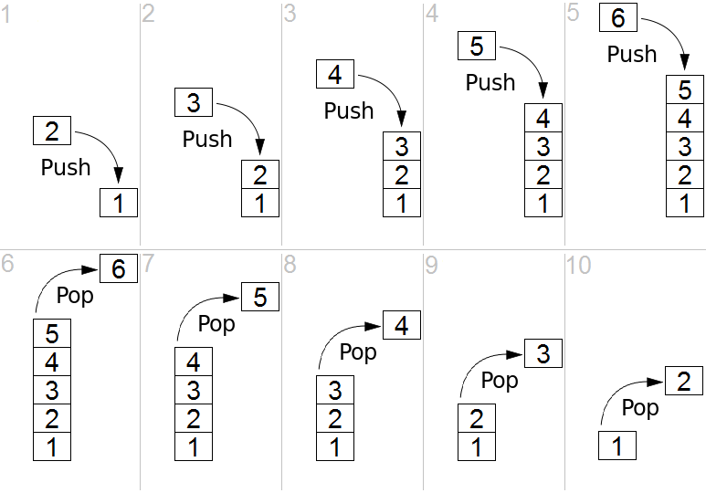
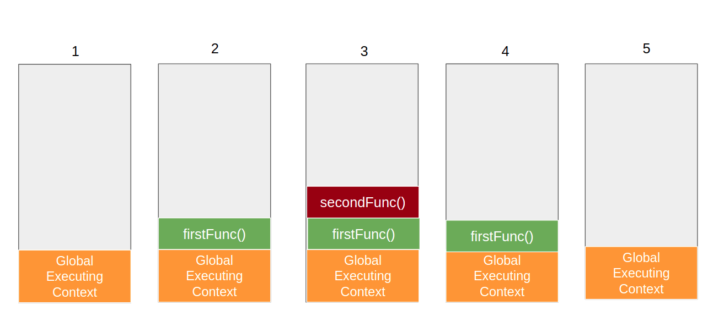

The execution context in JavaScript is arguably the most important thing for you to understand, as a firm understanding will give you the basic knowledge you need to comprehend more complex concepts such as hoisting and closure.

Before we start it’s important for me to mention that this article focuses on how it works within the language scope and not the engine. While the core principles are the same, implementations may vary in different engines.

In a previous article, we discussed [how the JS Engine works](https://frontendmeta.com/how-js-works-behind-the-scenes-the-engine/). If you’re not already familiar, I recommend you start there. Otherwise, let’s jump in and talk about the ‘execution context’!

## What is the Execution Context?

In layman’s terms, **the execution context represents the environment in which our codes run.**

The deeper we dive into this subject the more you’ll understand what exactly the environment is. For now, you can think of it as a box that contains all our code.

In JS, we have different types of code. There’s code that’s in the global context. Then there’s code that’s inside a function context. There’s also code that’s within an eval function.

Each of these different types of code is evaluated within a dedicated execution context. 

Every time your app calls a function, a new execution context is created. In recursive functions, every time the function calls itself, a new execution context is created, therefore you can theoretically have an infinite number of execution contexts.

So to sum it up, you can have 3 different types of execution contexts:

- **Global Execution Context –** Every code that’s not within a function, is in the global environment. There can only be one global environment, and a global environment also contains a global object (window in the browser) and the value of this in non strict mode is equal to the global environment.
- **Function Execution Context –** Every time a function is executed, a new execution context is created for that function. So every function has an execution context of its own which is created when the code is calling the function, and not before.
- **Eval Execution Context –** This is created when an eval function is called, but since most developers don’t use eval we’ll not talk about it in this article.

## The Execution Stack

The execution stack (also called calling stack in other languages) is a data structure of a [Stack](https://en.wikipedia.org/wiki/Stack_(abstract_data_type)), which is used as a collection of all execution contexts which are active while the code runs.

The Stack works in a way called LIFO (Last in, first out). What that means, is that the last item that goes into the stack is also the first that comes out of the stack. 

Here’s a visual representation of how it works:



## How the Stack Works

Now that you have a basic understanding of how a stack looks, we can examine how it works. 

In general, we can think of each context as either a caller or a callee. If a certain code calls another function, then the context of that code is the caller, and the context of the code which is called is the callee.

A context can be a caller and a callee at the same time, e.g. a function that is called from the global context, and then calls another function.

When a caller calls a function, the caller stops the execution and effectively gives the control flow to the callee. At that moment that callee is pushed to the execution context and becomes the active execution context.

Once the code in the active execution context finishes running, the control flow goes back to the caller, and the function proceeds.

Let’s take the following code as an example:

```javascript
function firstFunc() {
    console.log('Executing first function')
    secondFunc();
}

function secondFunc() {
   console.log('Executing second function')
}

firstFunc();
```

Here’s how it will look like in terms of the call stack:



As you can see, the call stack works in a synchronous way, the active stack always represents the context that is currently active, in the order in which it was called.

You might be wondering how the stack works when you have asynchronous code. That’s definitely interesting and a subject for another article, but in short, the call stack works with synchronous operations, when you perform an asynchronous operation, it goes into the stack only after it’s free and all synchronous code is completed. We’ll elaborate more about this in the future.

## The Process of Creating an Execution Context

Now that we understand what an execution context is and how the call stack works, a few important questions still linger. Why do we even need the execution context? What is it responsible for? And what does an execution context contain?

Every time an execution context is created, it happens in two phases:

1. The Creation Phase
2. The Execution Phase

The creation phase begins when an execution context is created but before the code runs. Let’s take for example a function call.

When you call a function, you might think the code immediately runs but in reality the creation phase starts but the code doesn’t actually execute. There are a few things that happen before it’s executed.

I like to think of the creation phase as a form of a template. In the creation phase, a template is created, and in the execution phase, the template is filled with the relevant information.

What is this template? 

During the creation phase the engine goes over the code, and every time it comes across a declaration of a variable or a function, it saves the variables without their actual value (except function arguments, where the value is saved).

Then in the execution phase, the engine will run over that template and execute each relevant part.

This process repeats itself every time a new execution context is created, the engine creates a template of the variables and function declarations, and only then in the execution phase goes and actually assigns the variables values and actually executes the code.

### **Example Code**

Let’s take a look at a quick example to see how this works.

```javascript
function helloWorld (world) {
 var foo = 'foo'
 const bar = 'bar'
 let fooBar = 'fooBar'
 console.log('Hello, ' + world)
}

helloWorld('earth')
```

1. When this code will run, first of all a global execution context will be created and the engine will save the declaration of the helloWorld function with the argument that’s provided to the world parameter – ‘earth’.
2. Then, in the execution phase, the engine will execute this function, and a new execution context will be created for that function.
3. In the creation phase of the helloWorld execution context, the engine will save the variable name of type var with an initial value of undefined.
4. Let and const will be saved with an initial value of uninitialized.
5. Once the creation phase has completed, the execution phase starts. This is where the assignment of the variables happen and the code gets executed.
6. Foo will be assigned to ‘foo’ and executed.
7. Bar will be assigned to ‘bar’ and executed.
8. fooBar will be assigned to ‘fooBar’ and executed.
9. Then the console.log function will be executed and ‘Hello, earth’ will be printed.

### **Visual Representation**

Here’s a visual representation that can help us understand how the function execution looks like in the creation phase, and in the execution phase.

First, in the creation phase:

```
FuntionExecutionContext = {
  foo: undefined,
  bar: < uninitialized >,
  fooBar: < uninitialized >,
  Arguments: {0: 'world', length: 1},
}
```

Then, in the execution phase:
```
FuntionExecutionContext = {
   foo: 'foo',
   bar: 'bar',
   fooBar: 'fooBar',
   Arguments: {0: 'world', length: 1},
}
```
Keep in mind that this is only the function execution context, and in reality, there’s a global execution context that’s always created before any code runs.

It’s also important to mention that this visual representation is still an oversimplification of how the process works. In order to understand the entire picture, there are more concepts you’ll need to understand such as the LexicalEnvironment and this binding. We’ll talk about these subjects in future articles.

## Components of the Execution Context

Technically, an execution context contains the following things:
```
ExecutionContext = {
  ThisBinding: <this value>,
  VariableEnvironment: { ... },
  LexicalEnvironment: { ... }
}
```
All of these things are created during the creation phase, and each serves a different role. A variable environment for example is what actually holds the variables and their values.

Right now, you should have a general view of how an execution works. It’s not the best idea to cover all of these subjects in one article, and I know these subjects can get confusing, so for now don’t worry about it, just remember that there’s more to it.

## Summary

There are 3 types of execution context:

1. Global execution context – for code that’s in the global context
2. Functional Execution Context – for code that’s inside a function
3. Eval execution context – for code that’s inside the eval function

Each execution context is managed by the execution stack, in the form of a caller and a callee. We learned that there are two phases that happen every time an execution context is created:

1. The creation phase
2. The execution phase

In the creation phase, a certain template of the variables and functions is created. The declarations of a variable of type var are saved with an initial value of undefined, and for const and let an initial value of uninitialized. 

The function’s declarations are also saved, as well as the value of the arguments.

In the execution phase, the engine goes through the code, performs an assignment of the variables and executes the code.

We also mentioned that technically an execution context contains three things, LexicalEnvironment, VariableEnvironment and thisBinding. Since each of them is its own subject, we’ll continue to talk about them in the next articles.

**More Useful Resources:**

1. [Understanding Execution Context and Execution Stack in Javascript](https://blog.bitsrc.io/understanding-execution-context-and-execution-stack-in-javascript-1c9ea8642dd0)
2. [JavaScript The Core 2nd Edition](http://dmitrysoshnikov.com/ecmascript/javascript-the-core-2nd-edition/#execution-context)
3. [What is the Execution Context & Stack in JavaScript? by David Shariff](https://www.zcfy.cc/original/what-is-the-execution-context-amp-stack-in-javascript-by-david-shariff)

[](https://coralogix.com/blog/using-coralogix-stackpulse-to-automatically-enrich-alerts-and-manage-incidents/)
